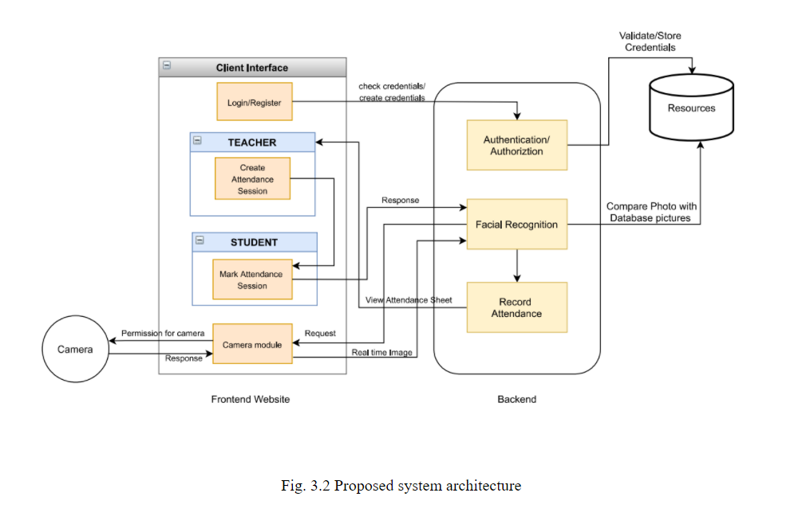

# Attendance-Website-Using-Facial-Recognition-Django

## Technologies Used
[][DJANGO]
[][JAVASCRIPT]
[][PYTHON]
[][SQL]
[][HTML]
[][CSS]

## Video

## Description

The attendance management system proposes login for both students and faculty. Student has to register first using his personal information such as name, contact details, Admission number(unique)branch and semester in which he/she is attending lectures . The unique ID(Admission number) which is recorded by students is used by the faculty for identification. The student's facial features are then recorded in the database with the help of a camera . These recorded facial features are then used for allowing students to easily login without any extra credentials . The model will be created using OpenCV. It detects the faces in the image and compares it with the recognized faces in the database.Facial recognition technique for automated attendance management system is implemented by using deep learning. It helps in conversion of the frames of the video into images so that the face of the student can be easily recognized for their attendance so that the attendance database can be easily reflected automatically . This model will be a successful technique to manage the attendance and records of students as faculty will get the names and information of students present in an Microsoft excel sheet too which can be further uploaded directly by faculty wherever necessary.

## Getting Started

### System Architecture

### Dependencies

* All dependencies can be found in requirements.txt

### Installing

* Clone the project install all the dependencies.

### Functionalities 

 * Student enrolment
 * Image pre-processing and noise removal
 * Model training
 * Face Detection
 * Database Creation For Attendance
 * Final Report Generation

### Executing program

* Just use the django commands to run the website 
* ex.python manage.py runserver

[JAVASCRIPT]: https://devdocs.io/javascript/
[DJANGO]: https://docs.djangoproject.com/en/3.1/
[PYTHON]: https://www.python.org/doc/
[SQL]: https://dev.mysql.com/doc/
[HTML]: https://devdocs.io/html/
[CSS]: https://developer.mozilla.org/en-US/docs/Web/CSS
